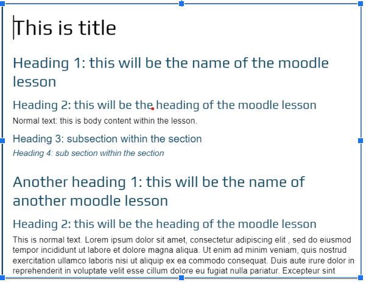
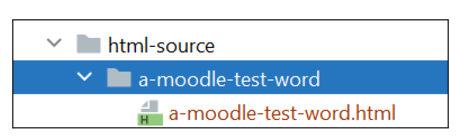
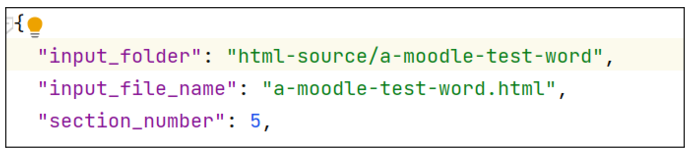
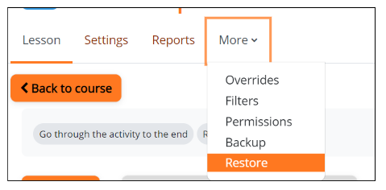

## Script Overview:
This script automates the generation of a Moodle backup file, facilitating the creation of one or more "Lesson"-type activities in Moodle.

## Key Features:

- Converts HTML source files into Moodle-compatible XML format.
- Organizes the converted files into a structured folder hierarchy.
- Packages the files into Moodle backup format using pre-configured template files exported from Moodle.
## Purpose:
The resulting backup file can be directly imported into Moodle, streamlining the creation of lessons and ensuring compatibility with Moodle's structure and requirements.

## Workflow:

Input:
- HTML source files and images are stored in the html-source/ directory, with each lesson in its own subfolder.

Output:
- Generated lesson folders and XML files are stored in outputs/for-many-lessons/. 
- Final backup file is stored under final_files/ folder named "backup_compressed.mbz".

Template Usage:
- XML templates, located in templates/for-many-lessons/lesson_441530_template/, are used as the basis for creating Moodle-compatible XML files.

## Usage
1. Prepare Word Document in Google Docs: 
- Format the document as follows:
    - Use Heading 1 for the title of each "Lesson"-type activity.
    - The content of the lesson follows the Heading 1 title.
    - Begin a new "Lesson"-type activity with the next Heading 1.
  [ image example of the Google Docs format]
  
2. Download and place the folder into html-source/ folder:
- Export the document as HTML:
  - In Google Docs, select the Download as HTML option.
  - This will produce a compressed file containing an HTML document and an images folder with all images.
- Extract the downloaded compressed file.
- Move the extracted folder into the html-source/ directory.

3. Update json.config file:
Edit the configuration file with the following details:
- input_folder: Path to the folder containing the HTML file and images.
- input_file_name: name of the HTML file.
- section_number: The section number in Moodle where the lessons will be imported.
  
4. Run the Script: 
- Execute the script main.py to generate the backup file.
- The output Moodle backup file will be saved in the final_files/ folder.
5. Import in backup file into Moodle:
- Use Moodle's Restore functionality to upload and import the generated backup file.

## Note:

- Do not include the text "[EXERCISES]" in the document.
The script is programmed to identify [EXERCISES] and exclude all subsequent content until it encounters the next Heading 1, which marks the beginning of a new lesson.

